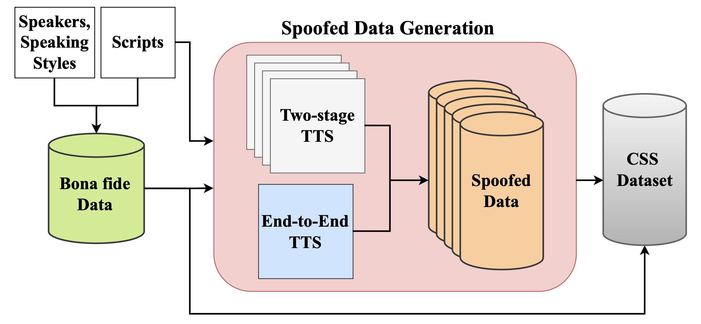

<!-- markdownlint-disable -->
# CSS - Chula Spoofed Speech Dataset

## Overview
This repository contains the official resources for the paper:

["Thai Speech Spoofing Detection Dataset with Variations in Speaking Styles"](https://www.isca-archive.org/interspeech_2025/urai25_interspeech.html)

The Chula Spoofed Speech (CSS) dataset is a large-scale Thai spoofed speech dataset consisting of 1,332,120 utterances, including both bona fide and synthetic speech. Synthetic samples are generated using five high-quality TTS systems, with all utterances matched to the same text as the real recordings. The dataset covers a wide range of ages and speaking styles, making it suitable for research in anti-spoofing, and robust speech modeling.

---

## Demo
🎧 👉 [Demo Page (Audio Samples)](https://slscu.github.io/CSS/)

---

## 📊 Dataset Construction



### 🔹 Bona Fide Data
- **20 professional voice actors** (10 male, 10 female)  
- **Age groups**: 8 adolescents, 9 working adults, 3 elderly individuals
- **Speaking styles**: 6 formal, 10 casual, 4 excited  
- **Scripts**: 11,101 shared scripts, recorded by all speakers  
- **Total**: **222,020 utterances (~270 hours)** at 44.1 kHz  

### 🔹 Spoofed Data
- Generated using the same **20 speakers** and **same scripts** as the bona fide set.  
- **Two-stage TTS systems**:  
  - Tacotron 2 + HiFi-GAN  
  - Tacotron 2 + UnivNet  
  - FastPitch + HiFi-GAN  
  - FastPitch + UnivNet  
- **End-to-End TTS system**:  
  - VITS (multi-speaker, trained with YourTTS methodology)  
- **Total spoofed utterances**: **1,110,100**  

### 🔹 Final Dataset
- **Total utterances**: **1,332,120**  
- **Total duration**: ~**1,620 hours**   

---

## 📂 Dataset Access
Due to agreements with the voice actors, this dataset is only available for research purposes on a case-by-case basis. We provide:

- 📁 Sample Data (available in this repository under **`data_samples/`**)
  
Inside the **`data_samples/`** folder, you will find two directories:
- **`Bona fide/`** — real human speech  
- **`Spoofed/`** — synthetic speech generated by TTS systems

```bash
data_samples/
├── Bona fide/
│   ├── Casual/
│   │   └── *.wav           # WAV files in casual speaking style
│   ├── Excited/
│   │   └── *.wav           # WAV files in excited speaking style
│   └── Formal/
│       └── *.wav           # WAV files in formal speaking style
├── Spoofed/
    ├── Casual/
    │   └── *.wav           # Spoofed WAV files in casual speaking style
    ├── Excited/
    │   └── *.wav           # Spoofed WAV files in excited speaking style
    └── Formal/
        └── *.wav           # Spoofed WAV files in formal speaking style

```

If you would like full access to the complete CSS dataset, please contact the author directly with a brief description of your research purpose.

📧 **Contact**: [ ekapol.c@chula.ac.th ]

📄 **Access policy**: For academic research only.

---

## Acknowledgement
This research was jointly supported by the PMU-C grant (C05F660049) and Amity Accentix Co., Ltd.

We would also like to express our sincere gratitude to all the voice actors who generously contributed their time and talent, making this project possible. The following individuals graciously provided their voices: สิรภพ ศรีเสาวนันท์, นิติ ธีรวิโรจน์, โสมฤทัย สอดส่อง, วริศรา เผือกผ่อง, พีรกานต์ สยาม, มธุรส นิ่มวิจิตร, ศิรสา ชลายนานนท์, จตุรงค์ ยามีภักดี, สุธีวัฒน์ ภิญโญ, นนที ถาวรพันธุ์, อนุชิต มณีชัย, ธรรมพร คำเคน, สิรภพ บาฬี, ชาณิช ชโลธรกรธวัช, ณัฐพงศ์ สุทธิไชย, อาทิตยา คำภีระ และ ปิยนุช ตันตระกูล, as well as others who chose to remain anonymous. Their contributions were essential to the success of this work.

---

## Citation

```bibtex
@inproceedings{urai25_interspeech,
  title     = {{Thai Speech Spoofing Detection Dataset with Variations in Speaking Styles}},
  author    = {Ticho Urai and Pachara Boonsarngsuk and Ekapol Chuangsuwanich},
  year      = {2025},
  booktitle = {{Interspeech 2025}},
  pages     = {5643--5647},
  doi       = {10.21437/Interspeech.2025-1895},
  issn      = {2958-1796},
}
```
<!-- markdownlint-enable -->

